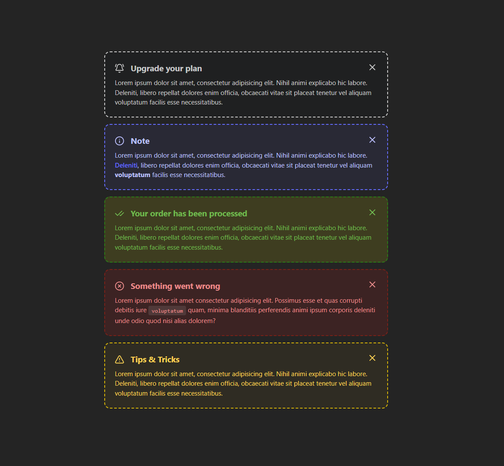

# Alert Component Project

## 📋 About

This is an educational React TypeScript project that demonstrates the implementation of a reusable Alert component system. The project showcases modern React development practices, TypeScript integration, and component design patterns.

## 📷 Preview



_Different types of alert components with various styles and functionalities_

## 🎯 Project Purpose

This project was created as a learning exercise to understand:

- **React Component Architecture**: Building reusable UI components
- **TypeScript Integration**: Type safety and interface definitions
- **Modern React Patterns**: Functional components with hooks
- **CSS-in-JS with SCSS**: Styling components with SCSS modules
- **Icon Integration**: Using Lucide React icons
- **Component Props Design**: Flexible and extensible component APIs

## 🚀 Features

### Alert Component Types

- **Default**: General information alerts
- **Info**: Informational messages
- **Success**: Success confirmations
- **Error**: Error notifications
- **Warning**: Warning messages

### Component Features

- ✅ **Flexible Content**: Supports both description text and custom children
- ✅ **Icon Integration**: Customizable icons for each alert type
- ✅ **Dismissible**: Close functionality with smooth animations
- ✅ **Responsive Design**: Works across different screen sizes
- ✅ **TypeScript Support**: Full type safety and IntelliSense
- ✅ **SCSS Styling**: Modern CSS with SCSS preprocessing

## 🛠️ Technologies Used

- **React 19.1.1** - Latest React with concurrent features
- **TypeScript 5.8.3** - Type safety and better development experience
- **Vite 7.1.2** - Fast build tool and development server
- **SCSS** - Advanced CSS preprocessing
- **Lucide React** - Beautiful and consistent icon library
- **ESLint** - Code linting and formatting

## 📦 Installation

1. Clone the repository:

```bash
git clone https://github.com/MahmoudAbdullah228/Alert.git
cd Alert
```

2. Install dependencies:

```bash
npm install
```

3. Start the development server:

```bash
npm run dev
```

4. Open your browser and navigate to `http://localhost:5173`

## 🏗️ Project Structure

```
src/
├── Components/
│   └── UI/
│       └── Alert/
│           ├── index.tsx      # Main Alert component
│           └── style.scss     # Component styles
├── Types/
│   └── index.ts              # TypeScript type definitions
├── App.tsx                   # Main application component
└── main.tsx                  # Application entry point
```

## 💡 What I Learned

### 1. **Component Design Patterns**

- How to create flexible, reusable components
- Props interface design for maximum flexibility
- Children prop usage for custom content

### 2. **TypeScript Best Practices**

- Type definitions for component props
- Union types for alert variants
- Interface design for maintainable code

### 3. **Modern React Development**

- Functional components with hooks
- Event handling and DOM manipulation
- Component composition patterns

### 4. **Styling with SCSS**

- SCSS module organization
- CSS custom properties usage
- Responsive design implementation

### 5. **Development Workflow**

- Vite build tool configuration
- ESLint setup for code quality
- TypeScript compilation and type checking

## 🎨 Usage Examples

### Basic Alert

```tsx
<Alert
  type="Info"
  icon={<Info />}
  title="Information"
  description="This is an informational message."
/>
```

### Alert with Custom Content

```tsx
<Alert type="Success" icon={<CheckCheck />} title="Success">
  <div className="custom-content">
    <p>Your action was completed successfully!</p>
    <button>Continue</button>
  </div>
</Alert>
```

## 🔧 Available Scripts

- `npm run dev` - Start development server
- `npm run build` - Build for production
- `npm run lint` - Run ESLint
- `npm run preview` - Preview production build

## 📚 Educational Benefits

This project helped me understand:

1. **Component Architecture**: How to structure React components for reusability
2. **TypeScript Integration**: Benefits of type safety in React development
3. **Modern Tooling**: Using Vite, ESLint, and modern development tools
4. **CSS Organization**: SCSS module patterns and responsive design
5. **Icon Libraries**: Integrating and using icon libraries effectively
6. **Props Design**: Creating flexible component APIs

## 🤝 Contributing

This is an educational project, but contributions are welcome! Feel free to:

- Report bugs
- Suggest new features
- Improve documentation
- Add new alert types

## 📄 License

This project is open source and available under the [MIT License](LICENSE).

## 👨‍💻 Author

**Mahmoud Abdullah** - [GitHub Profile](https://github.com/MahmoudAbdullah228)

---

_This project was created for educational purposes to learn modern React development practices and TypeScript integration._
